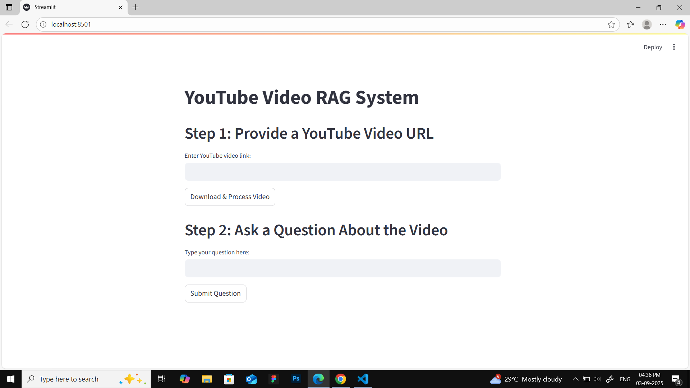
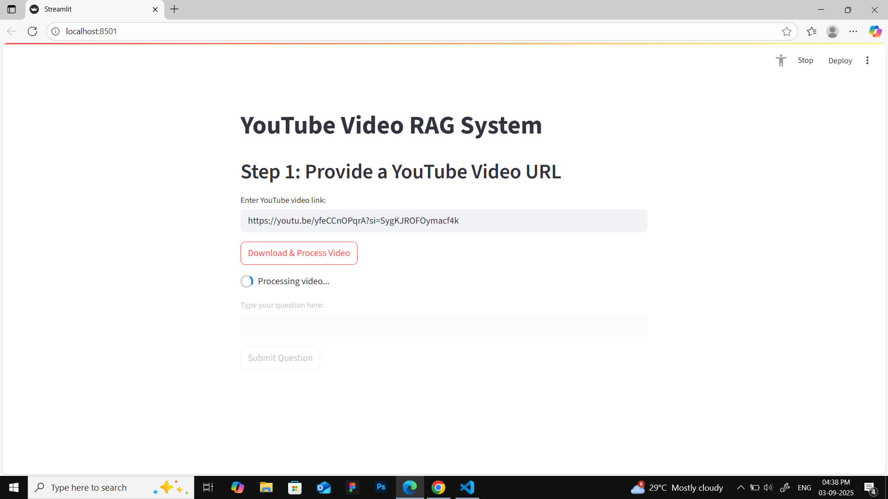
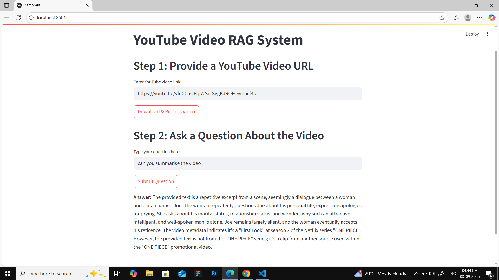

# QA with YouTube Videos 🎥🤖
This project allows you to ask questions about YouTube videos and get accurate answers using AI. The system extracts transcripts from YouTube videos and runs question-answering (QA) models on top of them.

---

## 🚀 Features
- Extracts transcripts from YouTube videos.
- Uses NLP models for question answering.
- Simple frontend for user interaction.
- Backend to handle processing and model inference.
- Easy setup with requirements.txt and environment variables.

---

## 📂 Repository Structure
```
qawithvideos/
│── backend.py        # Backend logic (API, QA model, transcript handling)
│── frontend.py       # Frontend interface (Streamlit / Flask UI)
│── venv/             # Virtual environment (ignored in production)
│── .env.example      # Example environment variables
│── readme.md         # Project documentation
│── requirements.txt  # Required dependencies
```

---

## ⚙️ Installation
1. Clone the repository:
   ```bash
   git clone https://github.com/yourusername/qawithvideos.git
   cd qawithvideos
   ```
2. Create and activate virtual environment:
   ```bash
   python -m venv venv
   source venv/bin/activate   # On Mac/Linux
   venv\Scripts\activate      # On Windows
   ```
3. Install dependencies:
   ```bash
   pip install -r requirements.txt
   ```
4.Setup environment variables:
- Copy .env.example → .env
- Add your YouTube API key and other configs.

---

## ▶️ Usage
Run Backend
```bas
python backend.py
```
Run Frontend
```bash
python frontend.py
```
Now open your browser at http://localhost:8501 (or the provided link).

---

## 📊 Example Workflow
1. Before (User Input)
Upload or paste a YouTube video link in the frontend.

2. Processing (Backend in Action)
The system extracts the transcript and runs the QA model.

3. After (Answer Generated)
The final answer is displayed on the frontend.



